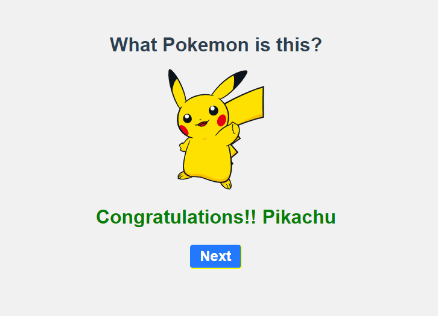

# Pokemon-game

<center></center>

Test the game here: [https://pokemon-game.ewvl.net/](https://pokemon-game.ewvl.net/).

Game made with Vuejs, based on the course

**Vue.js: From zero to expert**

[https://www.udemy.com/course/vuejs-fh/](https://www.udemy.com/course/vuejs-fh/).

## Project setup

```
npm install
```

### Compiles and hot-reloads for development

```
npm run serve
```

### Compiles and minifies for production

```
npm run build
```

### Run your unit tests

```
npm run test:unit
```

### Customize configuration

See [Configuration Reference](https://cli.vuejs.org/config/).

## 📄 License

[MIT](./LICENSE.md)

### Follow [ewvl.net](https://ewvl.net) ✌️ 👺 ✌️
